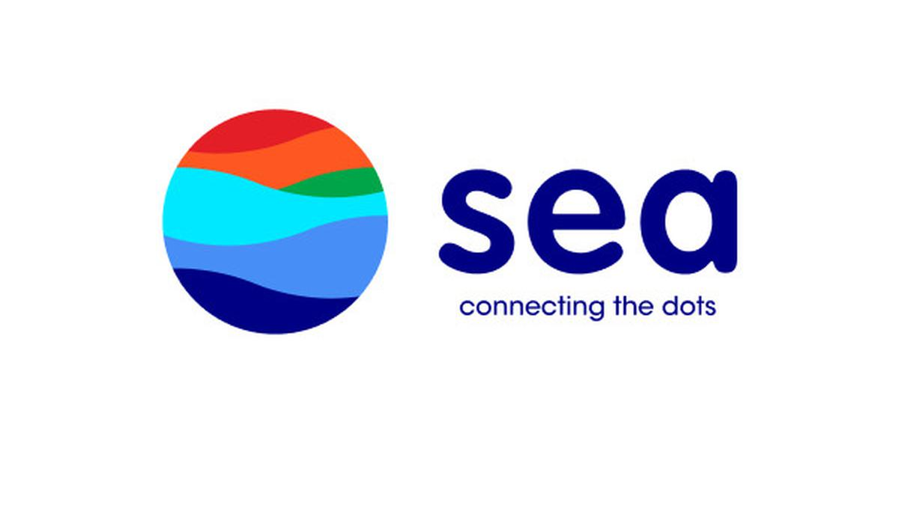

Hi there 👋, My name is **Kevin Christian**, a Data Science Graduate from 🇸🇬 **NUS** (Honours - Distinction). 

Currently, I am working as a Credit Risk Strategy Associate at **Sea Group**

Feel free to visit my LinkedIn Profile for more information: https://www.linkedin.com/in/kevinchs0808/

<h2>Work Experience</h2>

  
  
  

<h2>My Projects</h2>

 Projects | Description | Link
 --- | --- | ---
 🚗 RideNetwork | Exploring the journey of ride-hailing across New York City | <a href="https://github.com/kevinchs0808/RideNetwork">🔗</a>
 🧑‍🎤 GuessCountry | LastFM Social Network's Country Prediction | <a href="https://github.com/kevinchs0808/GuessCountry">🔗</a>
 ⛽ VizOil | Data Analytics for Investment & Export Strategies in The Oil & Gas Industry | <a href="https://github.com/kevinchs0808/VizOil">🔗</a>
 🛡️ Insurance Claim Fraud Detection | To minimize the number of fraudulent insurance claims and maintain company’s reputation | <a href="https://github.com/kevinchs0808/DSA4263-Project">🔗</a>
 🎵 Song Recommendation System | To improve user satisfaction by providing personalized songs suggestion | 
 🕵️ KafkaInsight | Simulating A Real Time Monitoring System | <a href="https://github.com/kevinchs0808/KafkaInsight/tree/main">🔗</a>
 🔀 HyperSpark | Parallelizing Your Model Finetuning | <a href="https://github.com/kevinchs0808/HyperSpark/tree/main">🔗</a>
 💹 AlphaTrustNet | Fraud Ranking System on Alpha Bitcoin's Investors Network | <a href="https://github.com/kevinchs0808/AlphaTrustNet/tree/main">🔗</a>
 🛗 LiftSim | S16 Building Elevator Optimization | <a href="https://github.com/kevinchs0808/LiftSim">🔗</a>
 🕸️ Dynamic Bayesian Network | A Probabilistic Graph Network Modelling which can represent relationships of multiple objects that always evolve overtime | <a href="https://drive.google.com/file/d/18ShvRHz_c6rVNIWSU0lZ3fBtd_PPGbRf/view">🔗</a>
 🏨 Hotel Booking Analytics | To help hotel managers to make the best business decision based on hotel demand trends. | <a href="https://github.com/kevinchs0808/Hotel_Booking_Analytics/blob/main/Hotel_Booking_Analytics.pdf">🔗</a>
 🎭 TWEMOJI | Predicting Emoji from Tweets | <a href="https://github.com/kevinchs0808/CS3244-Twemoji/blob/main/Models/BERT.ipynb">🔗</a>
 🚚 Vehicle Type Detection | To detect the vehicle type based on a picture | <a href="https://github.com/kevinchs0808/Data-Science-Projects/blob/main/Vehicle_Type_Detection.ipynb">🔗</a>

<!--
**kevinchs0808/kevinchs0808** is a ✨ _special_ ✨ repository because its `README.md` (this file) appears on your GitHub profile.

Here are some ideas to get you started:

- 🔭 I’m currently working on ...
- 🌱 I’m currently learning ...
- 👯 I’m looking to collaborate on ...
- 🤔 I’m looking for help with ...
- 💬 Ask me about ...
- 📫 How to reach me: ...
- 😄 Pronouns: ...
- ⚡ Fun fact: ...
-->
