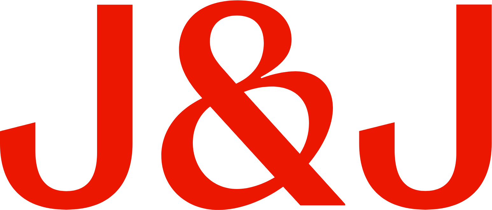
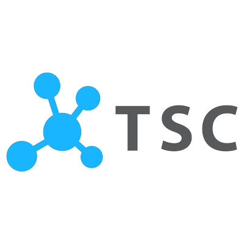

### Hi there 👋, My name is Kevin Christian, originally from 🇮🇩 Indonesia. I am currently a final year student of Data Science & Analytics at 🇸🇬 NUS.

<h2>Work Experience</h2>

    
    
    
    

<h2>My Projects</h2>

 Projects | 
Description
 | 
Link

 --- | --- | ---
 🕵️ KafkaInsight | Simulating A Real Time Monitoring System | https://github.com/kevinchs0808/KafkaInsight/tree/main
 🔀 HyperSpark | Parallelizing Your Model Finetuning | https://github.com/kevinchs0808/HyperSpark/tree/main
 💹 AlphaTrustNet | Fraud Ranking System on Alpha Bitcoin's Investors Network | https://github.com/kevinchs0808/AlphaTrustNet/tree/main
 🛗 LiftSim | S16 Building Elevator Optimization | S16 Building Elevator Optimization | https://github.com/kevinchs0808/LiftSim
 🕸️ Dynamic Bayesian Network | A Probabilistic Graph Network Modelling which can represent relationships of multiple objects that always evolve overtime | https://drive.google.com/file/d/18ShvRHz_c6rVNIWSU0lZ3fBtd_PPGbRf/view
 🏨 Hotel Booking Analytics | To help hotel managers to make the best business decision based on hotel demand trends. | https://github.com/kevinchs0808/Hotel_Booking_Analytics/blob/main/Hotel_Booking_Analytics.pdf
 🎭 TWEMOJI | Predicting Emoji from Tweets | https://github.com/kevinchs0808/CS3244-Twemoji/blob/main/Models/BERT.ipynb
 🚗 Vehicle Type Detection | To detect the vehicle type based on a picture | https://github.com/kevinchs0808/Data-Science-Projects/blob/main/Vehicle_Type_Detection.ipynb

<!--
**kevinchs0808/kevinchs0808** is a ✨ _special_ ✨ repository because its `README.md` (this file) appears on your GitHub profile.

Here are some ideas to get you started:

- 🔭 I’m currently working on ...
- 🌱 I’m currently learning ...
- 👯 I’m looking to collaborate on ...
- 🤔 I’m looking for help with ...
- 💬 Ask me about ...
- 📫 How to reach me: ...
- 😄 Pronouns: ...
- ⚡ Fun fact: ...
-->
