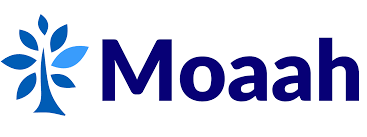

Hi there 👋, My name is **Kevin Christian**, originally from 🇮🇩 **Indonesia**. 

I am currently a final year student of Data Science & Analytics at 🇸🇬 **NUS**. 

Feel free to visit my LinkedIn Profile for more information: https://www.linkedin.com/in/kevinchs0808/

<h2>Work Experience</h2>

  
  
  
  

p>
<h2>My Projects</h2>

 Projects | Description | Link
 --- | --- | ---
 🕵️ KafkaInsight | Simulating A Real Time Monitoring System | <a href="https://github.com/kevinchs0808/KafkaInsight/tree/main">🔗</a>
 🔀 HyperSpark | Parallelizing Your Model Finetuning | <a href="https://github.com/kevinchs0808/HyperSpark/tree/main">🔗</a>
 💹 AlphaTrustNet | Fraud Ranking System on Alpha Bitcoin's Investors Network | <a href="https://github.com/kevinchs0808/AlphaTrustNet/tree/main">🔗</a>
 🛗 LiftSim | S16 Building Elevator Optimization | <a href="https://github.com/kevinchs0808/LiftSim">🔗</a>
 🕸️ Dynamic Bayesian Network | A Probabilistic Graph Network Modelling which can represent relationships of multiple objects that always evolve overtime | <a href="https://drive.google.com/file/d/18ShvRHz_c6rVNIWSU0lZ3fBtd_PPGbRf/view">🔗</a>
 🏨 Hotel Booking Analytics | To help hotel managers to make the best business decision based on hotel demand trends. | <a href="https://github.com/kevinchs0808/Hotel_Booking_Analytics/blob/main/Hotel_Booking_Analytics.pdf">🔗</a>
 🎭 TWEMOJI | Predicting Emoji from Tweets | <a href="https://github.com/kevinchs0808/CS3244-Twemoji/blob/main/Models/BERT.ipynb">🔗</a>
 🚗 Vehicle Type Detection | To detect the vehicle type based on a picture | <a href="https://github.com/kevinchs0808/Data-Science-Projects/blob/main/Vehicle_Type_Detection.ipynb">🔗</a>

<h2>My Skills</h2>

<h3>Natural Language Processing</h3>

- Large Language Model
- Information Retrieval
- Transformer Arhitecture
- Hugging Face
- LangChain

<h3>Time Series Forecasting</h3>

- ARIMA
- NBEATS
- Holt Winters
- Outlier Correction
- Ensembling Method

<h3>Graph Network Modelling</h3>

- Neo4j
- Community Detection
- NetworkX
- Graph Neural Network (familiar with basic theory)

<h3>Data Engineering</h3>

- Apache Spark
- Apache Kafka
- Apache Airflow
- Apache Hadoop (familiar with basic theory)

<h3>Cloud Computing</h3>

- AWS S3
- AWS Cognito
- AWS IAM
- AWS Elastic Beanstalk
- AWS Textract

<h3>Database System</h3>

- MySQL
- MongoDB
- Vector Database
- Neo4j
- ElasticSearch

<h3>CI/CD</h3>

- Docker
- Jenkins
- JFrog

<h3>Programming Language</h3>

- Python
- Scala
- TypeScript

<h3>Model Optimization</h3>

- Knowledge Distillation
- Mixed Precision Training

<!--
**kevinchs0808/kevinchs0808** is a ✨ _special_ ✨ repository because its `README.md` (this file) appears on your GitHub profile.

Here are some ideas to get you started:

- 🔭 I’m currently working on ...
- 🌱 I’m currently learning ...
- 👯 I’m looking to collaborate on ...
- 🤔 I’m looking for help with ...
- 💬 Ask me about ...
- 📫 How to reach me: ...
- 😄 Pronouns: ...
- ⚡ Fun fact: ...
-->
